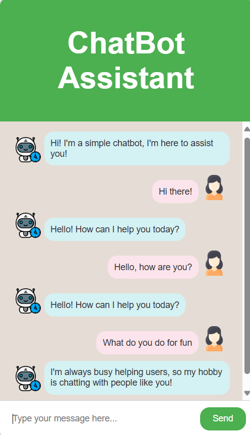

# CHAT-BOT
***Greetings Everyone🌻, This is my ChatBot built using Flask and Python*** 

*This task was assigned by AspireNex for the Artificial Intelligence Internship Selection Process*. 

**TASK 1 - CHATBOT WITH RULE-BASED RESPONSES** 
Build a simple chatbot that responds to user inputs based on predefined rules. Use if-else statements or pattern matching techniques to identify user queries and provide appropriate responses. This task will help us understand your knowledge of natural language processing and conversation flow.

 

*This chatbot is built using Flask and Python and utilizes regular expressions to handle various user inputs accurately.  
The main goal is to create a versatile chatbot that can manage different edge cases in user queries. 
This chatbot is built using Flask and Python, and it leverages regular expressions for advanced pattern matching to provide accurate responses to user queries*
 

  

  

🌵 https://gautamrajputmanya.wixsite.com/mysite 

📫 *gautamrajputmanya@gmail.com*
 
<image align="right" alt="coding" width="250" src="https://github.com/FlyingManya/FlyingManya/assets/98754211/0a854199-b287-4dca-a4cc-8265cbd3335e" alt="flyingmanya">

<h3 align="left">Connect with me:</h3>

<h3 align="left">Languages and Tools:</h3>

        

